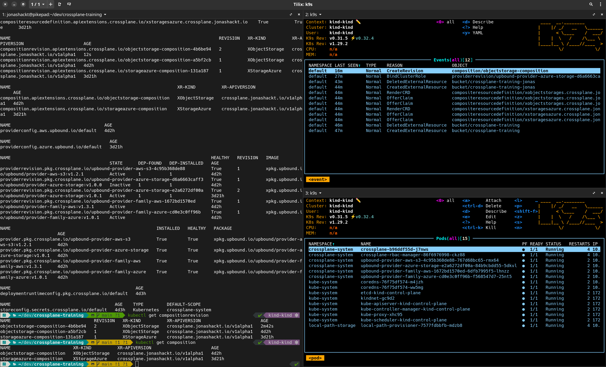

< Back to [training overview](README.md)

# 0. Prerequisites

For this training you should have a AWS iam user prepared with rights to deploy S3.

For the 7. Nested Compositions part you should also be able to create IAM roles, EC2 instances, VPCs & networking components (Subnets, SecurityGroups & Rules, etc), EKS clusters & node groups.

Also there are several tools needed:

## CLI tools: kind, helm, kubectl, AWS CLI, k9s

First be sure to have kind, the package manager Helm and kubectl installed:

```shell
# Mac
brew install kind helm kubectl

# Manjaro
pamac install kind-bin helm kubectl-bin
```

Also [install aws CLI and configure it](https://docs.aws.amazon.com/cli/latest/userguide/getting-started-install.html):

```shell
# Mac
brew install awscli

# Manjaro
pamac install aws-cli 
```

The command `aws configure` should work on your system.

Additionally we should have the [K8s workbench k9s](https://k9scli.io/) in place:

```shell
# See https://k9scli.io/topics/install/
# Mac / Linux
brew install derailed/k9s/k9s

# Manjaro
pamac install k9s
```

Now before working with Crossplane, let's prepare our console a bit. Using `k9s` you will be able to get much more insights into what Crossplane is doing! Here's my setup using a tiling Console using Tilix for example:




## A local K8s cluster with kind & CLI tools

In order to use Crossplane we'll need any kind of Kubernetes cluster to let it operate in. This management cluster with Crossplane installed will then provision the defined infrastructure. Using any managed Kubernetes cluster like EKS, AKS and so on is possible - or even a local [Minikube](https://minikube.sigs.k8s.io/docs/start/), [kind](https://kind.sigs.k8s.io) or [k3d](https://k3d.io/).

> For this training we're using [kind](https://kind.sigs.k8s.io).

Spin up a local kind cluster

```shell
kind create cluster --image kindest/node:v1.29.2 --wait 5m
```


## Install Crossplane CLI

> For this training we need Crossplane CLI >= `v1.15.0`!

https://github.com/crossplane/crossplane/releases/tag/v1.15.0

> Enhancements to the Crossplane CLI: New subcommands like `crossplane beta validate` for schema validation, `crossplane beta top` for resource utilization views similar to `kubectl top pods`, and `crossplane beta convert` for converting resources to newer formats or configurations.

Install crossplane CLI:

```shell
curl -sL "https://raw.githubusercontent.com/crossplane/crossplane/master/install.sh" |sh
```

If that produces an error like `Failed to download Crossplane CLI. Please make sure version current exists on channel stable.`, try to manually craft the download link:

```shell
curl --output crank "https://releases.crossplane.io/stable/current/bin/linux_amd64/crank"
chmod +x crank
sudo mv crank /usr/local/bin/crossplane
```

Be sure to have the `v1.15.0` version installed as a minimum, otherwise the `crossplane beta validate` command won't work:

```shell
crossplane --version
v1.15.0
```


## Install kuttl kubectl plugin

https://kuttl.dev/docs/cli.html 

```shell
# On a Mac
brew tap kudobuilder/tap
brew install kuttl-cli
```

Alternatively: One of the best ways to install a kubectl plugin is to use the package manager [krew](https://github.com/kubernetes-sigs/krew). So first install krew via your preferred package manager (see https://krew.sigs.k8s.io/docs/user-guide/setup/install/).

Now install kuttl via krew:

```shell
$ kubectl krew install kuttl

WARNING: To be able to run kubectl plugins, you need to add
the following to your ~/.zshrc:

    export PATH="${KREW_ROOT:-$HOME/.krew}/bin:$PATH"

and restart your shell.
```

Add the `export ...` statement to your shell configuration as mentioned in the install statement.

Now testdrive kuttl:

```shell
$ kubectl kuttl --version
kubectl-kuttl version 0.15.0
```

