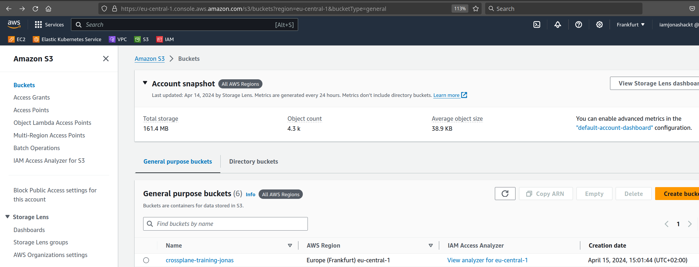

< Back to [training overview](README.md)

# 3. Working with Managed Resources

## 3.1 Using your first Managed Resource (AWS S3)

Let's create our first Crossplane Managed Resource, which should deploy a actual AWS S3 Bucket!

Therefore create a new directory `infrastructure/s3` and a file `simple-bucket.yaml`.

Search [the Provider docs on the Upbound Marketplace ](https://marketplace.upbound.io/providers/upbound/provider-aws-s3)for the `Bucket` resource and create your first Managed Resource.


Example:

```yaml
apiVersion: s3.aws.upbound.io/v1beta1
kind: Bucket
metadata:
  name: crossplane-training-yourNameHere
spec:
  forProvider:
    region: eu-central-1
```

> Now before applying the Managed Resource, let's have a look if our terminal is ready: Check the right pane in `k9s` and type `:events` to see the management cluster events there. Also press `Shift + L` to see the latest events on top. More [shortcuts in k9s can be found here](https://www.hackingnote.com/en/cheatsheets/k9s/).


When you're ready apply it to your management cluster:

```shell
kubectl apply -f infrastructure/s3/simple-bucket.yaml
```

You should see a `CreatedExternalResource` event in `k9s`.


Check [your AWS Console!](https://eu-central-1.console.aws.amazon.com/s3) Your first Crossplane managed infrastructure resource should come alive.




After having seen the Bucket beeing deployed we also want to know how to delete it again. Therefore run:

```shell
kubectl delete -f infrastructure/s3/simple-bucket.yaml
```

Again there should be an Event in `k9s` visible: a `DeletedExternalResource`.


## 3.2 Validate your MR against Provider schemes

### 3.2.1 Validate Managed Resources against a Crossplane provider

We need to provide the provider's schemes.

For example grab a Managed Resource (or multiple of them) and validate it against the AWS provider:

```shell
crossplane beta validate --cache-dir ~/.crossplane upbound/provider-aws/provider/provider-aws-s3.yaml infrastructure/s3/simple-bucket.yaml
package schemas does not exist, downloading:  xpkg.upbound.io/upbound/provider-aws-s3:v1.1.0
[✓] s3.aws.upbound.io/v1beta1, Kind=Bucket, crossplane-argocd-s3-bucket validated successfully
[✓] s3.aws.upbound.io/v1beta1, Kind=BucketPublicAccessBlock, crossplane-argocd-s3-bucket-pab validated successfully
[✓] s3.aws.upbound.io/v1beta1, Kind=BucketOwnershipControls, crossplane-argocd-s3-bucket-osc validated successfully
[✓] s3.aws.upbound.io/v1beta1, Kind=BucketACL, crossplane-argocd-s3-bucket-acl validated successfully
[✓] s3.aws.upbound.io/v1beta1, Kind=BucketWebsiteConfiguration, crossplane-argocd-s3-bucket-websiteconf validated successfully
Total 5 resources: 0 missing schemas, 5 success cases, 0 failure cases
```


### 3.2.2 Validate a full directory against XRDs or Provider schema

We can also validate a full directory:

```shell
crossplane beta validate --cache-dir ~/.crossplane upbound/provider-aws/provider/provider-aws-s3.yaml infrastructure
[!] could not find CRD/XRD for: crossplane.jonashackt.io/v1alpha1, Kind=ObjectStorage
[!] could not find CRD/XRD for: apiextensions.crossplane.io/v1, Kind=Composition
[!] could not find CRD/XRD for: pkg.crossplane.io/v1, Kind=Provider
[!] could not find CRD/XRD for: aws.upbound.io/v1beta1, Kind=ProviderConfig
[!] could not find CRD/XRD for: apiextensions.crossplane.io/v1, Kind=CompositeResourceDefinition
[✓] s3.aws.upbound.io/v1beta1, Kind=Bucket, crossplane-argocd-s3-bucket validated successfully
[✓] s3.aws.upbound.io/v1beta1, Kind=BucketPublicAccessBlock, crossplane-argocd-s3-bucket-pab validated successfully
[✓] s3.aws.upbound.io/v1beta1, Kind=BucketOwnershipControls, crossplane-argocd-s3-bucket-osc validated successfully
[✓] s3.aws.upbound.io/v1beta1, Kind=BucketACL, crossplane-argocd-s3-bucket-acl validated successfully
[✓] s3.aws.upbound.io/v1beta1, Kind=BucketWebsiteConfiguration, crossplane-argocd-s3-bucket-websiteconf validated successfully
Total 10 resources: 5 missing schemas, 5 success cases, 0 failure cases
```


## 3.3 Using multiple Managed Resources (public accessible S3 Bucket)

Now having a simple S3 Bucket already deployed, let's try to create a publicly accessible S3 Bucket using Crossplane Managed Resources. Therefore in `infrastructure/s3` create a new file `public-bucket.yaml`.


TODO: hints for public Bucket


https://github.com/aws/aws-cdk/issues/25288#issuecomment-1522011311

https://doc.crds.dev/github.com/crossplane/provider-aws/s3.aws.crossplane.io/Bucket/v1beta1@v0.39.0

https://docs.aws.amazon.com/AmazonS3/latest/userguide/access-policy-language-overview.html

https://stackoverflow.com/questions/76097031/aws-s3-bucket-cannot-have-acls-set-with-objectownerships-bucketownerenforced-s 

https://marketplace.upbound.io/providers/upbound/provider-aws/v0.34.0/resources/s3.aws.upbound.io/BucketPublicAccessBlock/v1beta1 


According to https://github.com/hashicorp/terraform-provider-aws/issues/28353 and https://registry.terraform.io/providers/hashicorp/aws/latest/docs/resources/s3_bucket_acl we need to separate `Bucket` creation from `BucketPublicAccessBlock`, `BucketOwnershipControls` and `BucketACL` - which should now be available finally leveraging the Upbound AWS Provider:


```yaml
apiVersion: s3.aws.upbound.io/v1beta1
kind: Bucket
metadata:
  name: crossplane-training-yourNameHere
spec:
  forProvider:
    region: eu-central-1
  providerConfigRef:
    name: default
---
apiVersion: s3.aws.upbound.io/v1beta1
kind: BucketPublicAccessBlock
metadata:
  name: crossplane-training-yourNameHere-pab
spec:
  forProvider:
    blockPublicAcls: false
    blockPublicPolicy: false
    ignorePublicAcls: false
    restrictPublicBuckets: false
    bucketRef: 
      name: crossplane-training-yourNameHere
    region: eu-central-1
---
apiVersion: s3.aws.upbound.io/v1beta1
kind: BucketOwnershipControls
metadata:
  name: crossplane-training-yourNameHere-osc
spec:
  forProvider:
    rule:
      - objectOwnership: ObjectWriter
    bucketRef: 
      name: crossplane-training-yourNameHere
    region: eu-central-1
---
apiVersion: s3.aws.upbound.io/v1beta1
kind: BucketACL
metadata:
  name: crossplane-training-yourNameHere-acl
spec:
  forProvider:
    acl: "public-read"
    bucketRef: 
      name: crossplane-training-yourNameHere
    region: eu-central-1
---
apiVersion: s3.aws.upbound.io/v1beta1
kind: BucketWebsiteConfiguration
metadata:
  name: crossplane-training-yourNameHere-websiteconf
spec:
  forProvider:
    indexDocument:
      - suffix: index.html
    bucketRef: 
      name: crossplane-training-yourNameHere
    region: eu-central-1
```


You may also want to validate the MRs against the Provider schemes again:

```shell
crossplane beta validate --cache-dir ~/.crossplane upbound/provider-aws/provider/provider-aws-s3.yaml infrastructure
```


## 3.4 Deploy a website to public accessible S3 Bucket

Let's deploy a example app (a simple [index.html](static/index.html)) to our S3 Bucket using the aws CLI like this:

```shell
aws s3 sync static s3://crossplane-training-yourNameHere --acl public-read
```

Now we can open up http://crossplane-training-yourNameHere.s3-website.eu-central-1.amazonaws.com/ in our Browser and should see our app beeing deployed :)


Before removing the Claim again, we should remove our `index.html` - otherwise we'll run into errors like this:

```shell
  Warning  CannotDeleteExternalResource  37s (x16 over 57s)  managed/bucket.s3.aws.crossplane.io  (combined from similar events): operation error S3: DeleteBucket, https response error StatusCode: 409, RequestID: 0WHR906YZRF0YDSH, HostID: x7cz2iYF/8Ag2wKtKRZUy1j3hPk67tBUOTFeR//+grrD7plqQ5Zo6EecO70KOOgHKbY7hUyp9vU=, api error BucketNotEmpty: The bucket you tried to delete is not empty
```

So first delete the `index.html`:

```shell
aws s3 rm s3://crossplane-training-yourNameHere/index.html
```

Now also the S3 Bucket should be removeable via Crossplane:

```shell
kubectl delete -f infrastructure/s3/public-bucket.yaml
```


> Discussion: Using multiple Managed Resources without Compositions is possible... but :)
